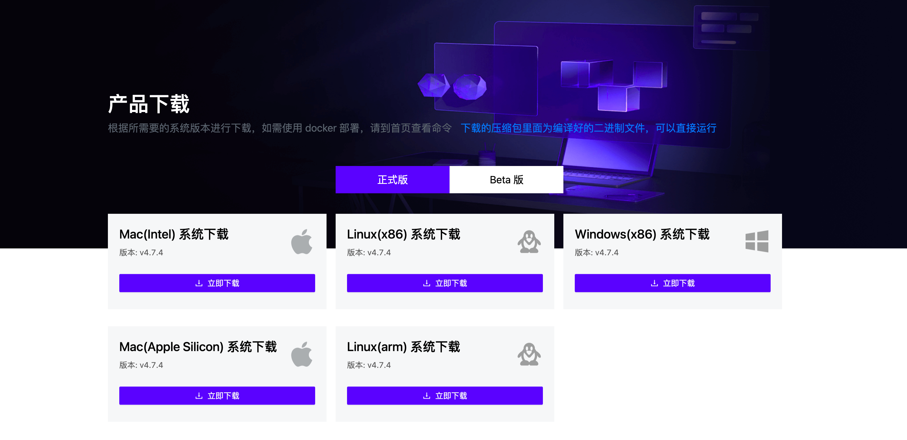
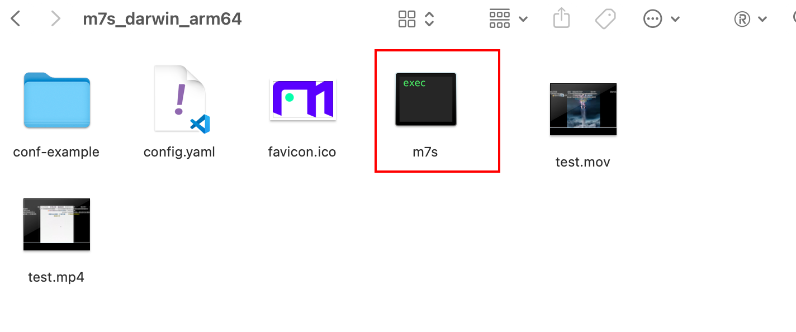
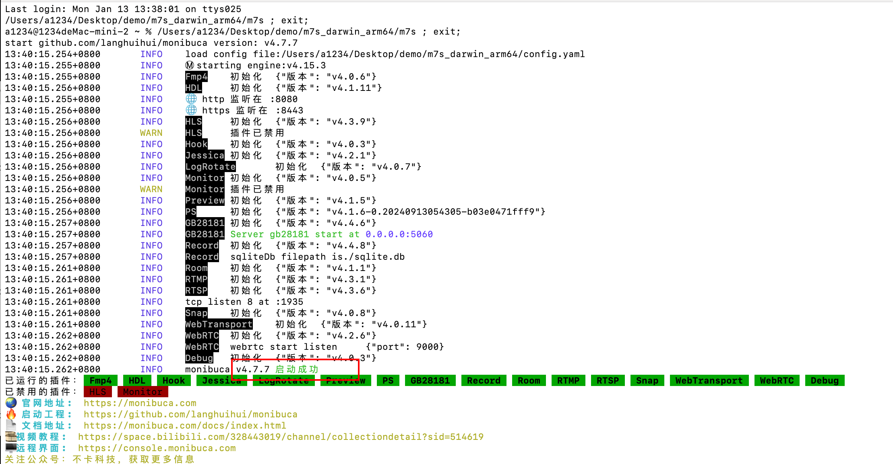
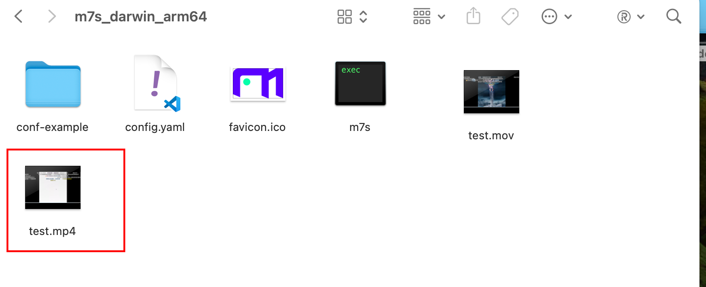
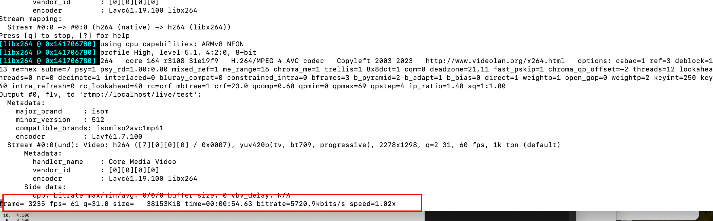
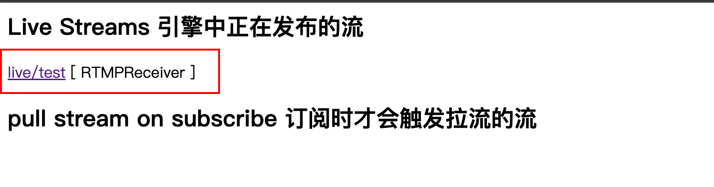
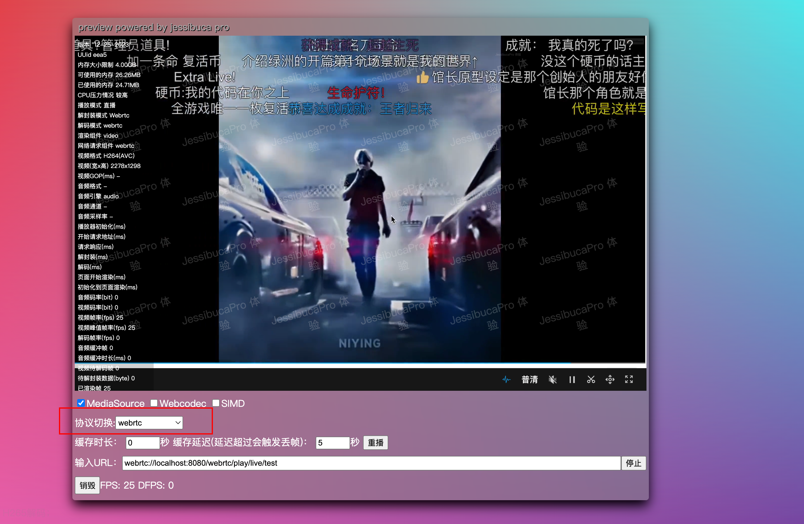
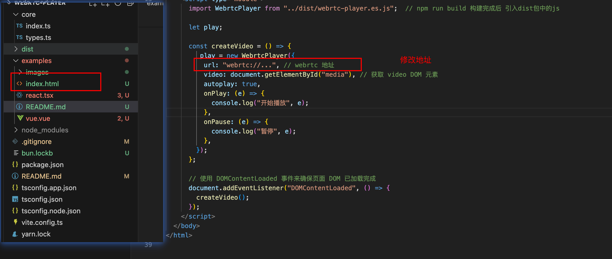
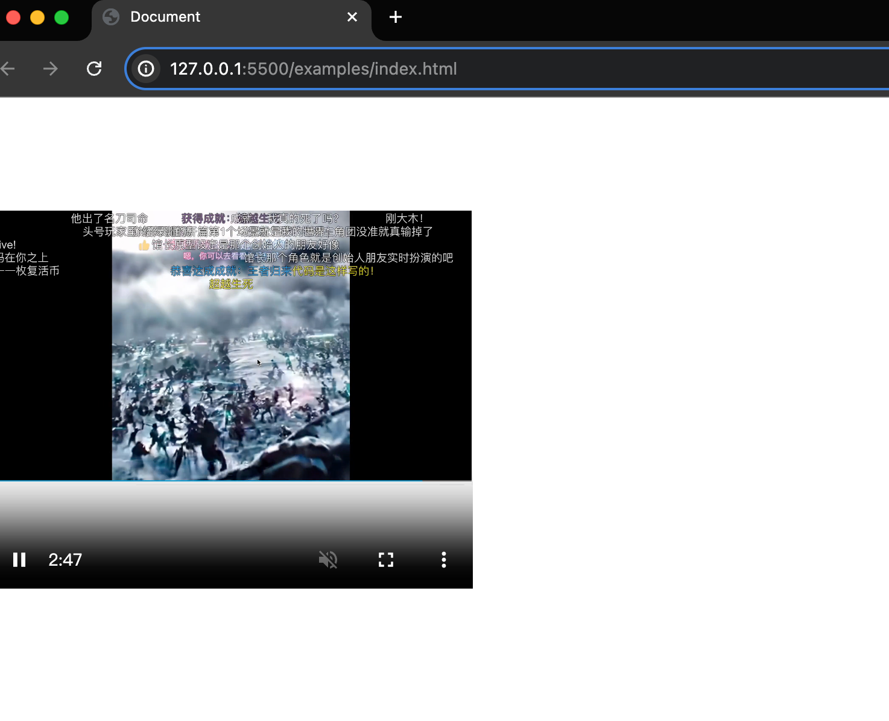

# 1.下载m7s 流媒体

下载地址：[m7s下载地址](https://www.monibuca.com/download)


选择你系统的包
本文档以 **Mac(Apple Silicon)** 为例子

# 1.启动流媒体服务器

双击m7s包启动：
会自动弹出终端表示成功:



# 3.推流

本文档采用安装包启动，如果是Docker 请查看文档操作:
[m7s文档/快速起步](https://www.monibuca.com/docs/guide/startup.html)

1.准备一个mp4文件



2.安装ffmpeg

```shell
brew install ffmpeg
```

3.推流
安装好ffmpeg后 在mp4 目录下 在终端执行下面的命令：

```shell
ffmpeg -stream_loop -1 -i test.mp4 -c:v libx264 -c:a aac -f flv rtmp://localhost/live/test
```

`-stream_loop -1` 表示无限重播

执行命令后：
有数据表示推流成功



# 4.预览和使用webrtc-player

**1.在浏览器打开 [http://localhost:8080/preview/](http://localhost:8080/preview/)**

点击进入到预览后台,m7s内置了播放器



**将协议切换到 webrtc 点击播放**



**进入 到examples文件夹 打开 [index.html](https://github.com/LxbNNN/webrtc-player/tree/main/examples/index.html) **

复制 m7s url 地址 webrtc://localhost:8080/webrtc/play/live/test



运行 html文件 播放成功


